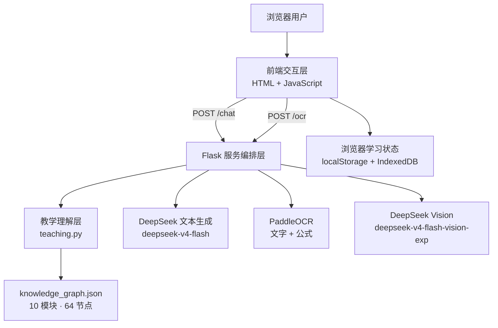

# 离散数学智能辅学系统

面向高校离散数学学习场景的 AI 智能辅学 Web 系统。系统以自由式学习交互为入口，将文本提问、图片识题、教学模式控制、知识识别、题目状态管理、AI 练习生成、错题订正复测、知识图谱与学习回顾组织到同一学习流程中。

## 项目信息

- 项目名称：离散数学智能辅学系统
- 参赛方向：人工智能 + 教育创新
- 学校：中国海洋大学
- 学部：信息科学与工程学部
- 项目负责人：朱明
- 年级：2025 级
- 专业：物理学
- 团队形式：单人项目
- 指导教师：宋宁
- 在线地址：https://discrete-math-tutor.zeabur.app
- 当前部署平台：Zeabur
- 部署历程：Render → Zeabur
- 当前服务器：Tencent Seoul 2C 4GB（2 核 CPU / 4 GB 内存）
- 当前服务器费用：US$4/月
- 截至 2026-09-10，DeepSeek API 累计实际支出：¥101.56

## 核心功能

### 1. AI 教学辅导

系统在 `teaching.py` 中将用户学习意图划分为五类教学模式：

- 提示引导
- 完整解析
- 概念讲解
- 练习出题
- 答案诊断

默认的题目求解采用“提示优先”：先给知识点与关键思路；用户明确要求完整答案时，再进入完整解析。

### 2. 离散数学知识识别

`teaching.py` 使用可解释规则识别 10 个课程模块，并将识别结果与 `knowledge_graph.json` 中的知识节点连接。当前知识图谱包含 10 个模块、64 个知识节点。

### 3. 图片识题与图形结构理解

图片入口采用两层处理：

1. PaddleOCR 识别普通文字与数学公式；
2. DeepSeek Vision 校对文字并补充图、树、哈斯图、箭头、二维结构等 OCR 难以表达的信息。

Vision 负责结构补充，不直接替代教学模块解题。Vision 调用失败时，系统保留 OCR 结果继续工作。

### 4. AI 生成题的正式登记

明确出题请求会通过结构化 `request_kind="exercise"` 传入后端。后端在返回题目之前完成：

- 题干提取；
- `generated_question` 登记；
- `generated_teaching` 知识分类；
- 可见题目与隐藏答案分离。

因此 AI 生成题不是普通聊天文本，而是可以进入后续错题、订正和复测流程的正式学习对象。

### 5. 当前题与历史题状态管理

前端维护题目候选、题目指纹和教学快照，并优先把自然语言指代解析为明确的“题目对象”，再构造发送给后端的上下文。当前支持的主要会话导航包括：

- 正序题号：如“第一题”“第 2 题”“第三道大题”；
- 倒序题号：如“倒数第一题”“倒数第二题”；
- 相对导航：如“上一道题”“下一道题”“再上一题”“往后 2 道题”；
- 边界指代：如“最开始那道题”“最后一道题”“当前这道题”；
- 组合导航：如“第 2 题的下一题”“最后一道题的上一题”；
- 主题指代：如“集合那道题”“数论那道题”；
- 短追问保持：如“继续”“为什么”“再解释一下”。

“第 2 小题”“第 2 问”等当前大题内部编号不会被误当成会话历史中的第 2 道题。显式导航目标不存在时，系统会提示无法定位，而不是静默退回另一道题。前端在定位成功后写入目标题指纹并构造强题目锚点，避免“下一题”等相对指令在前后端被重复计算。

“下一题”同时可能表示历史导航或继续出题：系统结合是否存在明确出题语义、当前位置和上下文进行区分，避免把“下一道题不太会”误判成生成新题。

当前上下文容量策略为：

- 后端单次最多接收 32 条消息；
- AI 历史最多保留 32 条消息；
- 历史总字符预算 60,000；
- 单条消息上限 6,000 字符；
- 显式题目状态不可用时，前端自然语言回退上下文取最近 12 条消息。

### 6. 错题—订正—复测闭环

错题本支持：

- 记为错题；
- 答案与解析；
- 笔记编辑；
- 完成订正；
- 针对原知识点生成新题复测；
- 提交复测答案并记录正确、错误或待继续判断的结果；
- 搜索、筛选、排序；
- PDF 导出。

复测采用独立的题目锚定链路：完成订正后，新复测会话直接保存原错题 `referenceQuestion`，并通过结构化 `exercise_reference` 把原题提交给后端，不依赖新会话中是否存在历史题。后端重新分析参照题知识点并强制进入练习出题模式；生成结果保存 `generated_question` 与隐藏的 `generated_answer`。学生提交答案时，仅核验本次复测题，避免与原错题或会话中的其他题混淆。

浏览器端最多保留 80 条错题记录。

### 7. 知识图谱与学习回顾

知识图谱用于展示：

- 当前题知识点；
- 建议前置知识；
- 直接后续知识；
- 当前题、当前会话与历史题范围的知识聚焦。

`prerequisites` 表示建议学习前置/依赖关系，不等同于严格数学逻辑蕴含。知识图谱不记录学生“掌握度”。

学习回顾读取浏览器中真实存在的学习记录与错题状态，不生成无数据依据的能力评分。

### 8. 数学内容渲染与导出

前端使用：

- Marked：Markdown 解析；
- DOMPurify：HTML 清洗；
- MathJax：LaTeX → SVG 数学渲染；
- html2canvas + jsPDF：错题 PDF 导出。

MathJax 使用 `fontCache: 'none'`，PDF 导出前还会处理 MathJax SVG 与辅助 MathML，避免截图式导出中重复绘制。

### 9. 个性化外观

系统支持：

- 跟随系统 / 浅色 / 深色；
- 蓝 / 紫 / 青绿主题色；
- 字号；
- 全局背景；
- 背景适配、遮罩、模糊；
- 面板透明度；
- 对话气泡透明度。

外观参数保存在 `localStorage`；自定义背景图片保存在 IndexedDB。

### 10. 120 项系统自测

截至 2026-09-10，项目已完成 120 项自测并全部通过。测试分为 6 组，每组 20 项：核心教学、OCR 多模态、上下文与错题闭环、前端与 PDF、部署稳定性、知识图谱专项。按优先级统计为 P0 55 项、P1 59 项、P2 6 项，测试记录中的 120 项状态均为“通过”。

其中上下文与错题闭环覆盖上一题/指定题号/主题指代、AI 生成题导航、短追问保持、错题登记、订正、复测生成、复测答案诊断与学习回顾；部署组覆盖健康检查、OCR 就绪、限流、依赖版本、浏览器兼容与生产域名等。详细说明见 [`docs/TESTING.md`](docs/TESTING.md)。

## 技术架构



更详细的架构说明见 [`docs/ARCHITECTURE.md`](docs/ARCHITECTURE.md)。

## 项目目录

```text
.
├── ai.py                  # DeepSeek 文本与视觉模型调用、系统教学提示、上下文裁剪
├── app.py                 # Flask 路由、请求校验、限流、OCR/AI编排、健康状态
├── teaching.py            # 教学模式、课程分类、知识点、本题难点、知识路径
├── ocr.py                 # PaddleOCR 文字/公式识别、图片预处理、模型降级
├── knowledge_graph.json   # 离散数学轻量知识图谱
├── requirements.txt       # Python 直接依赖
├── Dockerfile             # 容器部署
├── static/
│   └── script.js          # 前端状态、会话、错题、复测、图谱、PDF、外观
└── templates/
    └── index.html         # 页面结构、CSS、前端库加载、MathJax配置
```

## 主要接口

| 方法 | 路径 | 作用 |
|---|---|---|
| GET | `/` | 主页面 |
| POST | `/chat` | AI 教学对话、上下文锚定与生成题登记 |
| POST | `/analyze-questions` | 批量规则化分析历史题目，不调用大模型 |
| POST | `/ocr` | OCR + Vision 图片题理解 |
| GET | `/health` | Web 服务健康状态 |
| GET | `/ready` | Web 与 OCR 就绪状态 |

详见 [`docs/API.md`](docs/API.md)。

## 运行环境与依赖

### Python

项目 Docker 基础镜像：`python:3.10-slim`。

`requirements.txt` 直接依赖：

```text
Flask==3.1.2
requests==2.32.5
gunicorn==23.0.0
paddlepaddle==3.3.1
paddleocr[doc-parser]==3.7.0
numpy==1.26.4
opencv-contrib-python==4.10.0.84
Pillow==11.3.0
```

### 前端库

```text
MathJax 3.2.2
Marked 15.0.12
DOMPurify 3.2.6
html2canvas 1.4.1
jsPDF 2.5.2
```

第三方许可证见 [`THIRD_PARTY_LICENSES.md`](THIRD_PARTY_LICENSES.md)。

## 环境变量

| 变量 | 用途 | 默认行为 |
|---|---|---|
| `DEEPSEEK_API_KEY` | DeepSeek API 密钥 | 必需的外部服务凭据 |
| `DEEPSEEK_VISION_MODEL` | Vision 模型名 | `deepseek-v4-flash-vision-exp` |
| `VISION_ANALYSIS_ENABLED` | Vision 开关 | 默认为开启 |
| `DEEPSEEK_MAX_OUTPUT_TOKENS` | 文本输出 token 上限 | 默认 5000，代码约束在 2000–6000 |
| `PORT` | Web 监听端口 | Docker 启动默认 8080；直接运行 `app.py` 默认 5000 |

密钥仅由服务端环境变量读取，前端代码不保存 DeepSeek API Key。

## 本地启动

```bash
python -m pip install -r requirements.txt
export DEEPSEEK_API_KEY="your-key"
python app.py
```

Windows PowerShell：

```powershell
$env:DEEPSEEK_API_KEY="your-key"
python app.py
```

## Docker 启动

```bash
docker build -t discrete-math-tutor .
docker run --rm -p 8080:8080 \
  -e DEEPSEEK_API_KEY="your-key" \
  -e PORT=8080 \
  discrete-math-tutor
```

容器使用 Gunicorn：

```text
gunicorn -w 1 --threads 2 --timeout 300 -b 0.0.0.0:${PORT:-8080} app:app
```

部署说明见 [`docs/DEPLOYMENT.md`](docs/DEPLOYMENT.md)。

## 输入与资源限制

| 项目 | 当前代码值 |
|---|---:|
| 单条消息最大字符数 | 6,000 |
| 单次后端消息数 | 32 |
| AI 历史总字符预算 | 60,000 |
| 前端回退上下文消息数 | 12 |
| 单张题图大小 | 8 MiB |
| OCR 图片最长边 | 2,200 px |
| 聊天限流 | 20 次 / 60 秒 / 客户端IP |
| OCR 限流 | 10 次 / 60 秒 / 客户端IP |
| 浏览器错题上限 | 80 条 |

## 数据与隐私边界

- 会话、学习记录、错题和大部分个性化状态保存在浏览器 `localStorage`；
- 自定义背景图片保存在 IndexedDB；
- 聊天内容通过 Flask 后端发送到 DeepSeek Chat Completions API；
- Vision 开启时，图片会由后端发送给 DeepSeek Vision；
- OCR 在服务端使用 PaddleOCR CPU 推理；
- 前端不保存 DeepSeek API Key。

详见 [`docs/SECURITY_PRIVACY.md`](docs/SECURITY_PRIVACY.md)。

## AI 辅助开发说明

项目研发全过程使用 OpenAI ChatGPT GPT-5.6 Sol 进行辅助，包括方案讨论、架构设计、代码生成与修改建议、故障排查、知识图谱初始设计、数学内容校核、测试设计与文档整理。项目负责人负责需求定义、方案取舍、代码整合、运行验证、部署与最终结果审查。

系统生产运行时的文本生成与图像理解模型调用来自 DeepSeek API；ChatGPT GPT-5.6 Sol 属于研发过程中的辅助工具。

详见 [`docs/AI_ASSISTED_DEVELOPMENT.md`](docs/AI_ASSISTED_DEVELOPMENT.md)。

## 知识依据

知识图谱中的课程结构以以下权威教材/课程资料进行核验：

- 高等教育出版社《离散数学（第3版）》
- MIT OpenCourseWare — Mathematics for Computer Science
- Kenneth H. Rosen — *Discrete Mathematics and Its Applications*

完整列表见 [`docs/REFERENCES.md`](docs/REFERENCES.md)。
