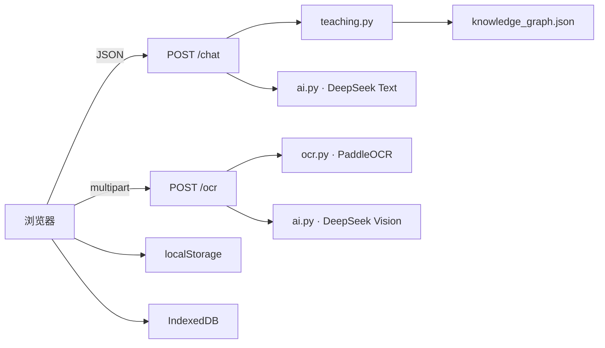

# 系统架构说明

## 1. 总体结构

系统由四个逻辑层组成：

1. **浏览器交互与学习状态层**：`templates/index.html` + `static/script.js`
2. **Flask 服务编排层**：`app.py`
3. **教学理解与知识组织层**：`teaching.py` + `knowledge_graph.json`
4. **模型与识别能力层**：`ai.py` + `ocr.py` + DeepSeek API + PaddleOCR



## 2. 文本学习链路

```text
用户最新输入
→ 前端解析是否存在显式题目指代
→ 构造当前题上下文与最新请求
→ POST /chat
→ app.py 清洗、限流、消息长度控制
→ teaching.py 分析教学模式、模块、知识点、本题难点、建议前置知识、知识路径
→ ai.py 拼接系统教学提示 + 教学上下文
→ DeepSeek deepseek-v4-flash
→ 返回回答与 teaching 元数据
→ 前端 Markdown/DOMPurify/MathJax 渲染
→ 更新当前题、会话与学习状态
```

### 教学模式

`teaching.py` 定义五类模式：

- `hint`：提示引导
- `full_solution`：完整解析
- `concept`：概念讲解
- `exercise`：练习出题
- `check_answer`：答案诊断

文本题求解默认采用提示优先。完整解析由用户的明确请求触发。

## 3. 上下文管理

### 后端边界

`app.py`：

```text
MAX_MESSAGES_PER_REQUEST = 32
MAX_MESSAGE_CHARS = 6000
```

`ai.py`：

```text
MAX_HISTORY_MESSAGES = 32
MAX_HISTORY_CHARS = 60000
MAX_MESSAGE_CHARS = 6000
```

AI 历史裁剪先限制消息条数，再从最新消息向前保留，在 60,000 字符总预算内优先保留最新上下文。

### 前端策略

`static/script.js`：

```text
FALLBACK_API_CONTEXT_MESSAGES = 12
```

前端先收集会话中的正式题目候选，再把用户输入解析为明确题目导航。导航层支持正序题号、倒序题号、上一/下一题、前后多步、第一/最后/当前题、组合导航和主题指代；“第 2 小题”“第 2 问”被视为当前大题内部编号，不进入会话历史题号导航。

定位成功后，前端把目标题写入当前 `learningQuestion`，同时在用户消息上保存 `targetQuestionFingerprint`，并构造包含“当前指向题目 + 本轮唯一请求”的强上下文。这样“下一题”等相对导航只计算一次，后端不再根据模糊聊天历史重新猜目标。

如果用户明确指向某一道历史题但目标不存在，前端直接给出定位失败提示，不静默回退到另一道题。对于“下一题”这类既可能表示导航也可能表示继续出题的短语，前端结合明确出题语义和当前题位置进行消歧。

当系统能解析出当前题时，前端优先发送“当前题上下文 + 最新用户请求”，而不是机械提交整个聊天历史。显式题目状态不可用时，才退回最近 12 条自然语言消息。

这种设计把“题目对象状态”“题目导航”和“近期自然语言历史”分开处理。

## 4. AI 生成题链路

```text
用户要求出题
→ 前端判断是否为独立主题出题或“参照某题”的同知识点出题
→ 前端设置 request_kind="exercise"
→ 若需要参照题，附带 exercise_reference.question
→ app.py 重新分析参照题，并把上下文收束为“当前指向题目 + 本轮唯一请求”
→ /chat 强制教学模式为 exercise
→ DeepSeek 生成题目与内部参考答案
→ app.py 分离可见题目和答案
→ 提取 generated_question
→ analyze_question(generated_question)
→ 生成 generated_teaching
→ 只有题干和分类均有效时才返回前端
→ 前端将题目登记为正式生成题
```

`exercise_reference` 只在 `request_kind="exercise"` 时有效，后端只接受其中的题干，并自行重新计算参照题的教学分类，避免信任前端提交的知识标签。

核心响应字段：

- `generated_exercise`
- `generated_question`
- `generated_teaching`
- `generated_answer`（仅供后续错题流程使用，不作为初次题目正文显示）

## 5. OCR + Vision 链路

### OCR 模型

`ocr.py` 当前配置：

- 文字检测：`PP-OCRv6_small_det`
- 文字识别：`PP-OCRv6_small_rec`
- 公式识别：`PP-FormulaNet_plus-S`
- 推理设备：CPU
- 图片最长边：2200 px

### 流程

```text
原始图片
→ Flask /ocr（8 MiB限制）
→ Pillow EXIF方向处理 + OpenCV/Numpy图像处理
→ PaddleOCR普通文字
→ PP-FormulaNet公式识别
→ DeepSeek Vision校对正文 + 解析图形结构
→ corrected_text / visual_text
→ 前端组合为题目上下文
```

普通文字 OCR 是基础能力；公式识别模块具有独立降级逻辑。Vision 调用失败时保留 OCR 输出。

## 6. 知识组织层

`knowledge_graph.json` 是 `teaching.py` 与前端知识图谱共用的数据源。

当前数据：

- 10 个模块
- 64 个节点
- 2 个“拓展”节点：RSA公钥密码、矩阵树定理

`prerequisites` 用于表示建议学习前置/依赖关系，不表示严格逻辑蕴含。

`teaching.py` 在规则识别后生成：

- `category`
- `knowledge_points`
- `focus_points`
- `prerequisite_points`
- `knowledge_path`
- `mode`
- `mode_label`

## 7. 浏览器学习状态

主要持久化键：

```text
discrete_math_ai_sessions_v1
discrete_math_ai_learning_v1
discrete_math_ai_appearance_v1
```

自定义背景资产使用 IndexedDB：

```text
discrete_math_ai_appearance_assets_v1
```

前端持久化内容包括会话、学习记录、错题状态、复测状态和外观参数。

## 8. 错题闭环

```text
正式题目
→ 记为错题
→ 答案 / 解析 / 笔记
→ 完成订正
→ 新建复测会话并保存原错题 referenceQuestion
→ 通过 exercise_reference 把原错题作为结构化参照提交
→ 生成同核心知识点、不同题面的复测题
→ 保存 generatedQuestion 与隐藏 generatedAnswer
→ 用户提交本次复测答案
→ 仅围绕“复测题 + 学生答案（+隐藏参考答案）”进行答案诊断
→ 更新正确/错误/待继续判断的复测记录
```

复测链路不依赖新建复测会话的历史题，因此不会因为新会话没有原题而出现“找不到参照题”。浏览器端错题数量上限为 80。

## 9. 前端内容安全与数学渲染

消息显示链：

```text
AI文本
→ 数学内容保护/整理
→ Marked 解析 Markdown
→ DOMPurify sanitize
→ 恢复数学片段
→ MathJax SVG 渲染
```

这一顺序避免把 Marked 当作 HTML 安全过滤器使用。

## 10. PDF 导出

错题 PDF 在浏览器端生成：

```text
错题DOM
→ 等待MathJax完成
→ 处理MathJax SVG / 辅助MathML
→ html2canvas
→ jsPDF
→ A4 PDF
```

MathJax 使用 SVG `fontCache: 'none'`，使导出 DOM 中公式字形不依赖共享 `<use>` 缓存。

## 11. 服务运行结构

Docker 启动命令：

```text
gunicorn -w 1 --threads 2 --timeout 300 -b 0.0.0.0:${PORT:-8080} app:app
```

`app.py` 使用 60 秒窗口的进程内请求记录进行限流：

- `/chat`：20 次 / 60 秒 / 客户端IP
- `/ocr`：10 次 / 60 秒 / 客户端IP

客户端IP从 `X-Forwarded-For` 首地址读取；没有该头时使用 `request.remote_addr`。
